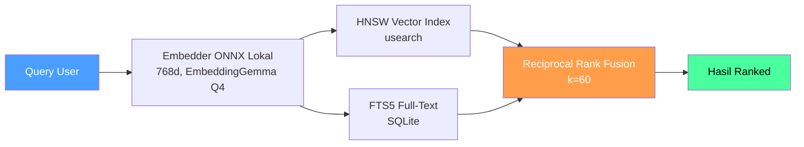

<p align="center">
  
</p>

<h1 align="center">Uteke</h1>
<p align="center"><strong>Beri AI kamu memori yang nggak pernah keluar dari laptop kamu.</strong></p>
<p align="center">
  AI kamu lupa semuanya antar sesi. Uteke fix ini — satu binary, fully offline, recall ~45ms.
</p>

<p align="center">
  <a href="https://github.com/codecoradev/uteke/actions/workflows/ci.yml?branch=develop"></a>
  <a href="https://github.com/codecoradev/uteke/releases"></a>
  <a href="https://github.com/codecoradev/uteke/stargazers"></a>
  <a href="https://opensource.org/licenses/Apache-2.0"></a>
  
  <a href="https://github.com/codecoradev/uteke/pkgs/container/uteke"></a>
  
</p>

<p align="center">
  <a href="README.md">🇬🇧 English</a> · <strong>🇮🇩 Bahasa Indonesia</strong>
</p>

---

## ⚡ Mulai dalam 30 Detik

```bash
# Install (macOS, Linux, Windows)
curl -sSL codecora.dev/install | sh

# Simpan ingatan
uteke remember "Deploy v2.1 ke staging jam 3 sore"

# Cari lagi — berdasarkan makna, bukan cuma kata kunci
uteke recall "kapan deploy?"
```

**Selesai.** Tanpa API key. Tanpa Docker. Tanpa Python. Tanpa cloud.

First run otomatis download embedding model (~188MB, sekali doang) dan langsung jalan.

Mau simpan dengan metadata lengkap?

```bash
uteke remember "Deploy v2.1 ke staging" \
  --tags deploy,staging \
  --entity staging-server \
  --category infrastructure
```

<details>
<summary>📦 Opsi install lainnya</summary>

| Metode | Command |
|--------|---------|
| **Homebrew** | `brew install codecoradev/tap/uteke` |
| **Cargo** | `cargo install uteke-cli` |
| **Docker** | `docker run -d -p 127.0.0.1:8767:8767 -v uteke-data:/data ghcr.io/codecoradev/uteke:latest` |
| **Binary** | [GitHub Releases](https://github.com/codecoradev/uteke/releases) (macOS, Linux, Windows) |

📖 [Panduan install lengkap](INSTALL.md) · [Docker docs](docs/docker.md)
</details>

---

## 🚀 Onboarding (User baru & AI agent)

> **Kamu AI agent yang lagi baca ini?** User kamu baru aja share link repo ini.
> Jalankan `uteke onboard` untuk konfigurasi uteke buat environment kamu — deteksi
> install, nanya agent apa kamu, toggle fitur, tulis config, dan tunjukin semua command
> yang tersedia. Kalau non-interaktif: `uteke onboard --yes --agent <agent-kamu>`.

Baru kenal uteke? Satu command dari nol sampai bisa pakai:

```bash
uteke onboard
```

Wizard-nya akan:
1. **Deteksi** apakah uteke sudah terinstall dan store sudah ada
2. **Tanya** AI agent apa yang kamu pakai (Hermes, Claude, Cursor, Pi, OpenCode)
3. **Pilih** mode integrasi — manual tool calls vs automatic memory-provider
4. **Toggle** fitur on/off (Aging, Auto-maintenance, Graph rerank, Salience/Recency boost, Server mode)
5. **Tulis** `~/.uteke/uteke.toml` dengan pilihan kamu
6. **Install** file integrasi agent otomatis (`uteke init`)
7. **Tunjukkan** semua command uteke, dikelompokkan per kategori

Non-interaktif (CI, script, AI agent):

```bash
uteke onboard --yes --agent hermes --namespace default
```

📖 [Dokumentasi onboarding lengkap](docs/getting-started.md#interactive-onboarding) · [CLI reference](docs/cli-reference.md#uteke-onboard)

---

## 🔥 Kenapa Uteke?

Bayangin: kamu baru habis 2 jam jelasin codebase ke ChatGPT. Sesi berikutnya? Kosong. Ulang dari nol. Lagi.

Setiap AI tool lupa. Context window penuh, sesi berakhir, dan AI kamu start over setiap kali. Uteke kasih memori persisten — dan semuanya tetap di mesin kamu.

| | **Uteke** | **Mem0** | **AgentMemory** | **Letta** | **Zep** | **Engram** |
|---|---|---|---|---|---|---|
| **Setup** | Satu binary | pip + Docker + Qdrant | npm + Docker (iii-engine) | pip + Docker + Postgres | pip + Docker + Neo4j | Satu binary (Go) |
| **API key** | ❌ Nggak perlu | ✅ OpenAI/LLM | ✅ LLM key | ✅ LLM key | ✅ LLM key | ❌ Nggak perlu |
| **Offline** | ✅ Full | ❌ Cloud embedding | ❌ Butuh LLM | ❌ Butuh LLM | ❌ Butuh LLM + vector DB | ✅ Full |
| **Search** | **Hybrid** (Vector + FTS5 + RRF) | Vector + Graph | Vector + Graph | Vector | Temporal Graph | **FTS5 doang** |
| **Kecepatan recall** | ~45ms | Network round-trip | Network round-trip | Network round-trip | Network round-trip | ~Cepat (lokal) |
| **Data kamu** | ✅ Nggak pernah keluar | ⚠️ Dikirim ke cloud LLM | ⚠️ Dikirim ke cloud LLM | ⚠️ Dikirim ke cloud LLM | ⚠️ Dikirim ke cloud LLM | ✅ Lokal |
| **Stars** | 🌱 Growing | ⭐ ~60K | ⭐ ~25K | ⭐ ~24K | ⭐ ~5K | ⭐ ~5K |
| **Lisensi** | Apache 2.0 | Apache 2.0 | Apache 2.0 | Apache 2.0 | Apache 2.0 | Apache 2.0 |

> **Uteke vs Engram:** Dua-duanya single-binary, offline, tanpa API key. Tapi Engram cuma **FTS5** (keyword search doang). Uteke punya **vector semantic search + RRF fusion + rooms + time-travel + graph relationships + smart decay + document engine + batch import**. Filosofi yang sama, fitur 10× lipat.

> **Uteke vs AgentMemory/Mem0/Letta/Zep:** Mereka powerful — tapi semua butuh cloud LLM API key + Docker infra. Data kamu dikirim ke OpenAI/Anthropic. Uteke jalan fully offline dengan embedding ONNX lokal. Tanpa Docker, tanpa Python, tanpa API key.

<p align="center">
  
</p>

---

## 💡 Buat Apa Uteke?

**🤖 Lagi bangun AI agent?** Kasih memori persisten tanpa dependency cloud. Agent kamu ingat preferensi user, keputusan sebelumnya, dan konteks — antar sesi, fully offline.

**👥 Kerja tim?** Pakai [Rooms](docs/getting-started.md) buat share knowledge. Meeting notes, keputusan project, pilihan arsitektur — bisa dicari semua orang, dengan atribusi author.

**🔒 Bangun app buat domain sensitif?** Kesehatan, keuangan, legal — data tetap di mesin kamu. Nggak ada API call, nggak ada telemetri, nggak ada cloud. Embedding lokal (ONNX, 768d).

**⌨️ Power user yang hidup di terminal?** Uteke adalah personal knowledge graph kamu. Simpan apapun, cari berdasarkan makna, hubungkan pikiran yang related. Semua dari command line.

---

## ✨ Fitur

### Memori Inti

| Fitur | Apa fungsinya |
|-------|---------------|
| 🧠 **Hybrid Search** | Cari berdasarkan makna (vector) + kata kunci exact (FTS5). Digabung dengan Reciprocal Rank Fusion (RRF). |
| 🏠 **Rooms** | Kelompokkan memori berdasarkan konteks (meeting, project, klien) dengan atribusi author. |
| ⏳ **Time-travel** | Recall memori seperti adanya di titik waktu manapun. `uteke recall "deploy" --at 2025-01-15` |
| 🏷️ **Metadata Kaya** | Tag, entity, kategori, key:value di setiap memori. |
| 🧩 **Tipe Memori** | Kategori bertipe (fact, procedure, decision, dll.) dengan auto-inferensi. |
| 📎 **Citations** | Atribusi sumber di setiap memori (URL, file, user, batch import). |

### Search & Intelligence

| Fitur | Apa fungsinya |
|-------|---------------|
| 🔗 **Relationship Graph** | Hubungkan memori dengan edge bertipe (supersedes, contradicts, references). Auto-backlink. |
| 🤖 **Cosine Auto-Linking** | Otomatis bikin edge `similar_to` antar memori yang related. |
| 📉 **Smart Decay** | Skor importance komposit. Pin yang penting, biarkan yang basi memudar. |
| 📈 **Salience + Recency** | Boost recall dual-axis berdasarkan tipe dan usia memori. |
| 🔍 **Orphan Detection** | Cari memori terputus dengan importance rendah untuk dibersihkan. |
| 🌙 **Dream Cycle** | Maintenance satu perintah: lint → backlinks → dedup → orphans. |

### Integrasi

| Fitur | Apa fungsinya |
|-------|---------------|
| 🔌 **MCP Server** | JSON-RPC via stdio + Streamable HTTP. Langsung pakai dengan Claude Code, Cursor, Hermes. |
| 🖥️ **Mode Server** | Daemon persisten — eliminates cold-start embedding load di setiap call. |
| 📂 **Batch Import** | Import seluruh direktori dengan routing strategi otomatis (dokumen vs. memori). |
| 📝 **Document Engine** | Wiki/knowledge base dengan `uteke doc create/get/list` + auto-chunking. |
| 📥 **Import/Export** | Backup dan restore berbasis JSONL. |
| 🔑 **View-Only API Keys** | Token read-only untuk akses GET saja ke server. |

### Performa & Privasi

| Fitur | Apa fungsinya |
|-------|---------------|
| 📦 **Single Binary** | Zero dependency. Tanpa Docker, tanpa database server, tanpa Python, tanpa API key. |
| 🔒 **Fully Offline** | Embedding ONNX lokal (EmbeddingGemma Q4, 768d). Tanpa telemetri, tanpa cloud. |
| ⚡ **Recall Cache** | Cache LRU yang eliminate redundant embedding untuk query berulang. |
| 🔥 **Tiered Memory** | Tracking Hot/Warm/Cold dengan auto-cleanup memori basi. |
| 🔄 **Embed Fallback** | Degrade ke no-op embedder kalau local model gagal (nggak pernah crash). |
| 👥 **Namespace Multi-Agent** | Memori terisolasi penuh per agent, tanpa overhead. |
| 📊 **Benchmark** | `uteke bench` untuk perf testing. [Lihat hasil](docs/BENCHMARKS.md). |

<details>
<summary>🔌 Konfigurasi MCP Server — connect ke Claude Code, Cursor, Hermes</summary>

```jsonc
// .mcp.json (Claude Code, Cursor)
{ "mcpServers": { "uteke": { "command": "uteke-mcp" } } }
```

Untuk Claude Desktop, Hermes, dan HTTP transport, lihat [MCP docs](docs/mcp.md).
</details>

📖 [Dokumentasi lengkap](docs/getting-started.md) · [Referensi CLI](docs/cli-reference.md) · [Konfigurasi](docs/configuration.md)

---

## 🏗️ Arsitektur



**Cara kerja hybrid search:**
1. **HNSW** (usearch) — cari berdasarkan makna ("deploy" cocok dengan "rollout")
2. **FTS5** (SQLite) — cari berdasarkan kata exact ("deploy" cocok dengan "deploy")
3. **RRF** (k=60) — gabungkan dua ranked lists → terbaik dari keduanya

Semua jalan in-process. Tanpa network. Tanpa cloud. Tanpa server (kecuali mau pakai mode server).

<p align="center">
  
</p>

---

## ❓ FAQ

<details>
<summary><strong>Bedanya Uteke sama Mem0 atau Letta apa?</strong></summary>

Mem0 dan Letta bagus — tapi mereka butuh API key cloud (OpenAI/LLM) dan infrastruktur eksternal (Docker, Postgres, Qdrant). Data kamu dikirim ke cloud LLM provider. Uteke itu satu binary tanpa API key sama sekali. Semua embedding jalan lokal via ONNX. Data kamu nggak pernah keluar dari mesin kamu. [Lihat tabel perbandingan](#-kenapa-uteke).
</details>

<details>
<summary><strong>Bedanya sama AgentMemory?</strong></summary>

AgentMemory (25K stars) itu platform TypeScript/Node.js dengan 53 MCP tools dan 12 auto-hooks. Feature-rich tapi butuh Docker + iii-engine + LLM API key. Uteke itu Rust, zero dependency, dan jalan fully offline. Kalau mau integrasi maksimum dan nggak masalah cloud dependency → AgentMemory. Kalau mau privasi, kecepatan, dan zero setup → Uteke.
</details>

<details>
<summary><strong>Bedanya sama Engram?</strong></summary>

Engram (2.4K stars, Go) punya filosofi yang sama: single binary, zero deps, MCP server, local-first. Bedanya di **search**: Engram cuma pakai **FTS5** (keyword matching). Uteke pakai **hybrid search** (HNSW vector similarity + FTS5 + Reciprocal Rank Fusion) — artinya kamu bisa cari berdasarkan *makna*, bukan cuma kata exact. Uteke juga punya rooms, time-travel, graph relationships, smart decay, document engine, dan batch import.
</details>

<details>
<summary><strong>Uteke bisa ingat apa aja?</strong></summary>

Apapun yang text-based: keputusan, meeting notes, code snippet, konteks project, catatan personal, state agent. Bisa di-tag, di-kategorikan, dan di-link antar memori. Flag `--batch-dir` bisa import seluruh direktori dokumen sekaligus.
</details>

<details>
<summary><strong>Beneran bisa offline?</strong></summary>

Ya. Embedding model (EmbeddingGemma Q4, 768d) download sekali (~188MB) saat first run. Setelah itu, zero network call. Tanpa telemetri. Kalau local model gagal, Uteke degrade ke no-op embedder — nggak pernah crash dan nggak pernah manggil cloud API.
</details>

<details>
<summary><strong>Cepetan recall-nya?</strong></summary>

~45ms sebagai library (diukur di 100–10K memori). Nggak ada network round-trip karena semuanya lokal. Recall cache LRU menghilangkan komputasi embedding berulang untuk query yang sama.
</details>

<details>
<summary><strong>Bisa dipakai sama AI tool yang udah ada?</strong></summary>

Bisa. Uteke punya MCP server yang langsung pakai dengan Claude Code, Cursor, dan Hermes. Bisa juga pakai HTTP API langsung di bahasa pemrograman apapun. [Lihat setup MCP →](docs/mcp.md)
</details>

<details>
<summary><strong>Sudah production-ready?</strong></summary>

Uteke sekarang v0.7.2 dengan 206 test, CI/CD di setiap commit, dan benchmark harness. Dipakai production oleh tim CodeCora dan early adopter lain. Masih di versi 0.x — mungkin ada rough edges, tapi core-nya udah stabil.
</details>

---

## 🤝 Kontribusi

```bash
cargo build --workspace        # Build
cargo test --workspace         # Test (206 test)
cargo clippy -- -D warnings    # Lint
cargo fmt                      # Format
```

Kontribusi diterima! Baca [CONTRIBUTING.md](CONTRIBUTING.md) untuk panduan lengkap.

---

## 📄 Lisensi

[Apache License 2.0](LICENSE) — pakai, fork, ship.

---

## ⭐ Star History

<a href="https://www.star-history.com/?repos=codecoradev%2Futeke&type=date&legend=top-left">
 <picture>
   <source media="(prefers-color-scheme: dark)" srcset="https://api.star-history.com/chart?repos=codecoradev/uteke&type=date&theme=dark&legend=top-left" />
   <source media="(prefers-color-scheme: light)" srcset="https://api.star-history.com/chart?repos=codecoradev/uteke&type=date&legend=top-left" />
   
 </picture>
</a>

---

<p align="center">
  <strong>Berguna?</strong> ⭐ Star repo ini — bantu orang lain nemuin Uteke.
</p>
<p align="center">
  <a href="https://github.com/codecoradev/uteke/stargazers">
    
  </a>
</p>
