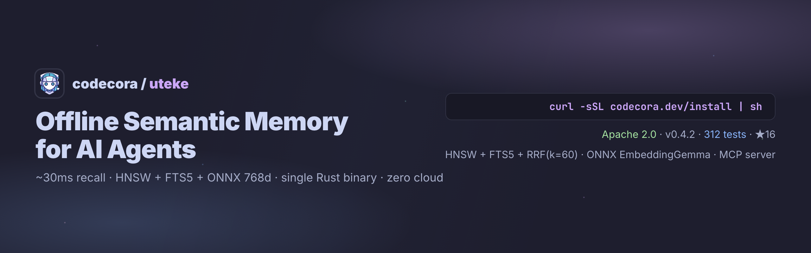
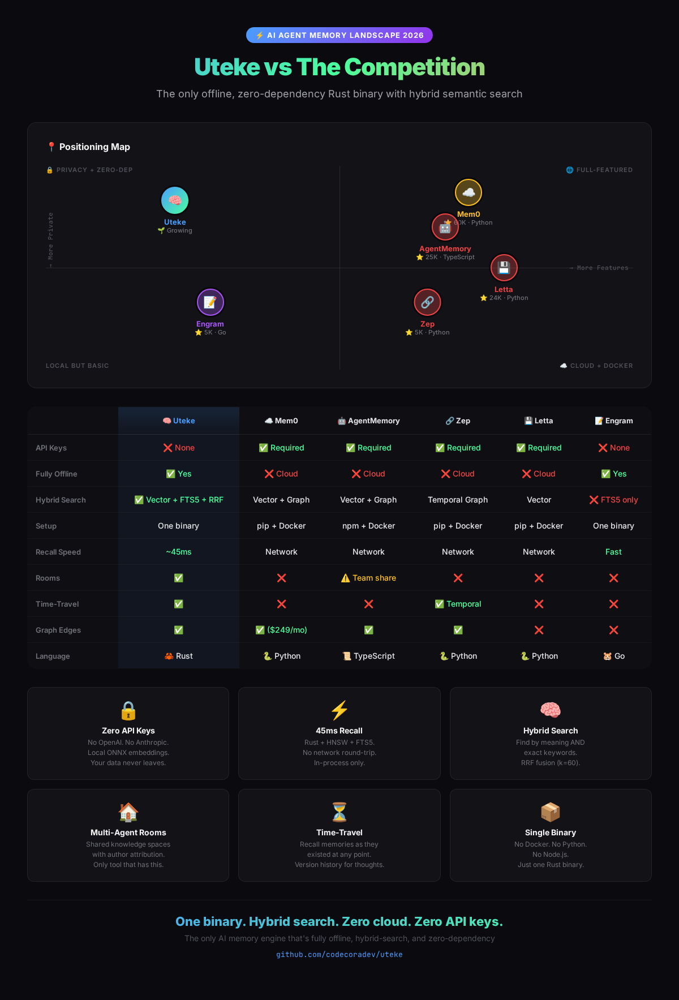
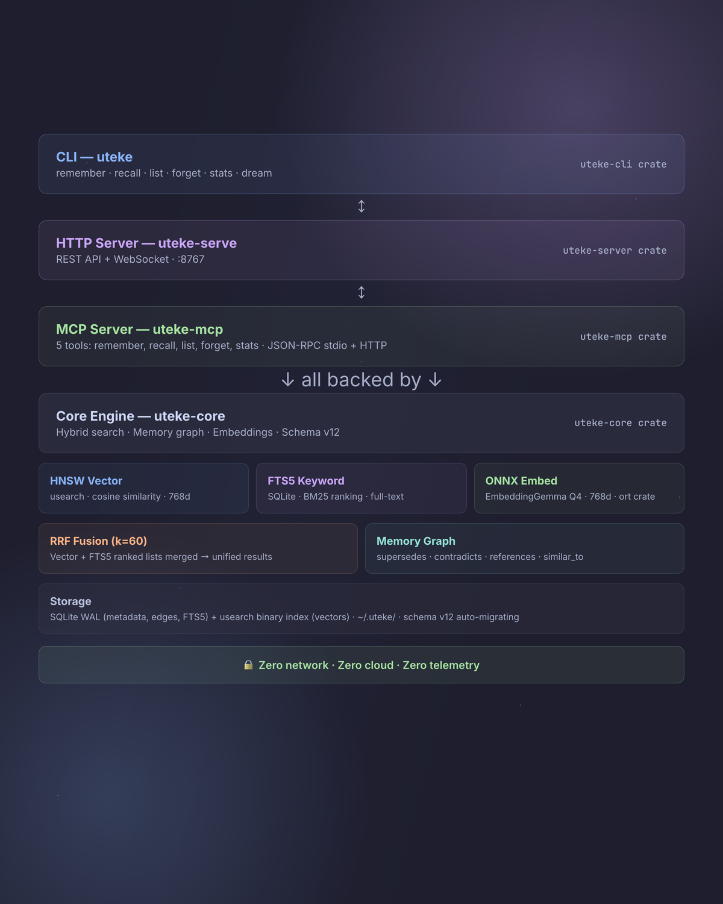

<p align="center">
  
</p>

<h1 align="center">Uteke</h1>
<p align="center"><strong>Give your AI a memory that never leaves your machine.</strong></p>
<p align="center">
  <em>Offline-first semantic memory engine — single binary, zero config, 30ms recall.</em>
</p>
<p align="center">
  <a href="https://github.com/codecoradev/uteke/actions/workflows/ci.yml?branch=develop"></a>
  <a href="https://opensource.org/licenses/Apache-2.0"></a>
  
  
</p>

<p align="center">
  <strong>🇬🇧 English</strong> · <a href="README.id.md">🇮🇩 Bahasa Indonesia</a>
</p>

---

## Quick Start

```bash
# Install (macOS, Linux, Windows)
curl -sSL codecora.dev/install | sh

# Store a memory with metadata
uteke remember "Deploy v2.1 to staging" --tags deploy,staging \
  --entity staging-server --category infrastructure

# Hybrid search (vector + FTS5, ranked by RRF)
uteke recall "when do we deploy?"

# Stats
uteke stats
```

**That's it.** No API keys. No Docker. No Python. First run downloads the embedding model (~188MB) and you're good to go.

> 📖 [Install options](INSTALL.md) · [Pre-built binaries](https://github.com/codecoradev/uteke/releases) · [Docker](https://github.com/codecoradev/uteke/pkgs/container/uteke) · [Full docs](https://github.com/codecoradev/uteke/tree/develop/docs)

### Docker

> Listens on localhost only by default. See [Docker docs](docs/docker.md) for auth setup.

```bash
# One-liner (model pre-baked in image)
docker run -d --name uteke -p 127.0.0.1:8767:8767 -v uteke-data:/data \
  ghcr.io/codecoradev/uteke:latest

# Or docker compose
docker compose up -d
```

📖 [Docker docs](docs/docker.md) · [Compose file](docker-compose.yml)

---

## Why Uteke?

AI agents forget everything between sessions. Uteke gives them persistent, searchable memory — entirely offline, in one binary.

| | **Uteke** | **Mem0** | **Letta** | **Zep** |
|---|---|---|---|---|
| **Setup** | Single binary | pip + Docker + Qdrant | pip + Docker + Postgres | pip + Docker + Neo4j |
| **API keys needed** | ❌ None | ✅ OpenAI/LLM key | ✅ LLM key | ✅ LLM key |
| **Offline** | ✅ Fully | ❌ Cloud embedding | ❌ Needs LLM server | ❌ Needs LLM + vector DB |
| **Semantic search** | ✅ Local ONNX + FTS5 hybrid | ✅ Cloud embedding | ⚠️ Keyword + archival | ✅ GraphRAG |
| **Full-text search** | ✅ FTS5 built-in | ❌ | ⚠️ Keyword only | ❌ |
| **Recall speed** | ~30ms (library) | Network round-trip | Network round-trip | Network round-trip |
| **Privacy** | ✅ Data never leaves machine | ⚠️ Data sent to LLM | ⚠️ Data sent to LLM | ⚠️ Data sent to LLM |
| **License** | Apache 2.0 | Apache 2.0 | Apache 2.0 | Apache 2.0 |

<p align="center">
  
</p>

---

## Key Features

- 🧠 **Hybrid Search** — Vector similarity + FTS5 full-text search, merged by Reciprocal Rank Fusion (RRF)
- 🏠 **Rooms** — Group memories by context (meetings, projects) with author attribution
- ⏳ **Time-travel queries** — Recall memories as they existed at any point in time
- 🔌 **Pluggable embeddings** — Swap ONNX/OpenAI/Ollama backends via config
- 🏷️ **Metadata Enrichment** — Tag, entity, category, and key:value metadata on every memory
- 🔗 **Relationship graph** — Link memories with typed edges (supersedes, contradicts, references)
- 📉 **Smart decay** — Composite importance scoring, pin critical memories
- ⚡ **Recall cache** — LRU cache eliminates redundant embedding for repeated queries
- 📊 **Benchmarks** — Built-in `uteke bench` for perf testing + LongMemEval retrieval harness
- 👥 **Multi-Agent Namespaces** — Fully isolated memory per agent, zero overhead
- 🖥️ **Server Mode** — Persistent daemon with ~42ms warm recall (75x faster than CLI)
- 🔥 **Tiered Memory** — Hot/Warm/Cold tracking with auto-cleanup of stale memories
- 🔒 **Fully Offline** — Local ONNX embeddings (768d), no telemetry, no cloud, no API calls
- 📦 **Single Binary** — Zero dependencies. No Docker, no database server, no Python, no API keys
- 📥 **Import/Export** — JSONL-based backup and restore
- 🧩 **Memory Types** — Typed categories (fact, procedure, decision, etc.) with auto-inference
- 🔗 **Backlinks** — Bidirectional memory edges — references are automatically reciprocal
- 📜 **Timeline Events** — Chronological audit log per memory (created, updated, superseded)
- 📈 **Salience + Recency** — Dual-axis recall boost by memory type and age
- 🌙 **Dream Cycle** — One-command maintenance pipeline (lint → backlinks → dedup → orphans)
- 🔍 **Orphan Detection** — Find disconnected, low-importance memories for cleanup
- 📎 **Citations** — Source attribution on every memory (URL, file, user, import)
- 🔌 **MCP Server** — JSON-RPC over stdio + Streamable HTTP transport
- 📝 **Document Engine** — Wiki/knowledge base with `uteke doc create/get/list` and auto-chunking
- 🤖 **Cosine Auto-Linking** — Automatically creates `similar_to` edges between related memories
- 🌐 **Graph API** — `GET /graph` endpoint returns nodes + edges JSON for visualization
- 🔑 **View-Only API Keys** — Read-only tokens for safe GET-only access to the server
- 📄 **Markdown Chunker** — Splits documents by headings, respects code blocks and token limits

📖 [Full documentation](docs/getting-started.md) · [CLI reference](docs/cli-reference.md) · [Configuration](docs/configuration.md)

---

## Architecture

<p align="center">
  
</p>

**Hybrid search pipeline:**

- **HNSW** (usearch) — vector similarity, finds by meaning
- **FTS5** (SQLite) — full-text keyword search, finds by exact terms
- **Reciprocal Rank Fusion** (k=60) — merges both ranked lists → best of both worlds
- **Local ONNX** (EmbeddingGemma Q4, 768d) — embeddings computed on-device, no API calls

Everything runs in-process. No network. No cloud. No server required (unless you want server mode).

---

## Development

```bash
cargo build --workspace        # Build
cargo test --workspace         # Test (327 unit tests)
cargo clippy -- -D warnings    # Lint
cargo fmt                      # Format
```

See [CONTRIBUTING.md](CONTRIBUTING.md) for the full contribution guide.

---

## License

[Apache License 2.0](LICENSE) — use it, fork it, ship it.

---

## Star History

<a href="https://www.star-history.com/?repos=codecoradev%2Fcora-cli%2Ccodecoradev%2Futeke&type=date&legend=top-left">
 <picture>
   <source media="(prefers-color-scheme: dark)" srcset="https://api.star-history.com/chart?repos=codecoradev/cora-cli%2Ccodecoradev/uteke&type=date&theme=dark&legend=top-left" />
   <source media="(prefers-color-scheme: light)" srcset="https://api.star-history.com/chart?repos=codecoradev/cora-cli%2Ccodecoradev/uteke&type=date&legend=top-left" />
   
 </picture>
</a>
