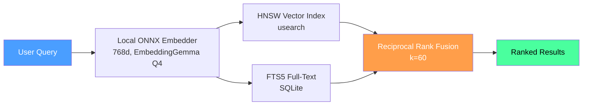

<p align="center">
  
</p>

<h1 align="center">Uteke</h1>
<p align="center"><strong>Give your AI a memory that never leaves your machine.</strong></p>
<p align="center">
  Your AI forgets everything between sessions. Uteke fixes that — one binary, fully offline, ~45ms recall.
</p>

<p align="center">
  <a href="https://github.com/codecoradev/uteke/actions/workflows/ci.yml?branch=develop"></a>
  <a href="https://github.com/codecoradev/uteke/releases"></a>
  <a href="https://github.com/codecoradev/uteke/stargazers"></a>
  <a href="https://opensource.org/licenses/Apache-2.0"></a>
  
  <a href="https://github.com/codecoradev/uteke/pkgs/container/uteke"></a>
  
</p>

<p align="center">
  <strong>🇬🇧 English</strong> · <a href="README.id.md">🇮🇩 Bahasa Indonesia</a>
</p>

---

## ⚡ 30-Second Quick Start

```bash
# Install (macOS, Linux, Windows)
curl -sSL codecora.dev/install | sh

# Store a memory
uteke remember "Deploy v2.1 to staging at 3pm"

# Search it back — by meaning, not just keywords
uteke recall "when do we deploy?"
```

**That's it.** No API keys. No Docker. No Python. No cloud.

First run downloads the embedding model (~188MB, one-time) and you're running.

Want richer memories? Add metadata:

```bash
uteke remember "Deploy v2.1 to staging" \
  --tags deploy,staging \
  --entity staging-server \
  --category infrastructure
```

<details>
<summary>📦 More install options</summary>

| Method | Command |
|--------|---------|
| **Homebrew** | `brew install codecoradev/tap/uteke` |
| **Cargo** | `cargo install uteke-cli` |
| **Docker** | `docker run -d -p 127.0.0.1:8767:8767 -v uteke-data:/data ghcr.io/codecoradev/uteke:latest` |
| **Binary** | [GitHub Releases](https://github.com/codecoradev/uteke/releases) (macOS, Linux, Windows) |

📖 [Full install guide](INSTALL.md) · [Docker docs](docs/docker.md)
</details>

---

## 🔥 Why Uteke?

You just spent 2 hours explaining your codebase to ChatGPT. Next session? Blank slate. Again.

Every AI tool forgets. Context windows fill up, sessions end, and your AI starts over every single time. Uteke gives it persistent memory — and keeps it on your machine.

| | **Uteke** | **Mem0** | **AgentMemory** | **Letta** | **Zep** | **Engram** |
|---|---|---|---|---|---|---|
| **Setup** | One binary | pip + Docker + Qdrant | npm + Docker (iii-engine) | pip + Docker + Postgres | pip + Docker + Neo4j | One binary (Go) |
| **API keys** | ❌ None | ✅ OpenAI/LLM | ✅ LLM key | ✅ LLM key | ✅ LLM key | ❌ None |
| **Works offline** | ✅ Fully | ❌ Cloud embedding | ❌ Needs LLM | ❌ Needs LLM | ❌ Needs LLM + vector DB | ✅ Fully |
| **Search** | **Hybrid** (Vector + FTS5 + RRF) | Vector + Graph | Vector + Graph | Vector | Temporal Graph | **FTS5 only** |
| **Recall speed** | ~45ms | Network round-trip | Network round-trip | Network round-trip | Network round-trip | ~Fast (local) |
| **Your data** | ✅ Never leaves machine | ⚠️ Sent to LLM cloud | ⚠️ Sent to LLM cloud | ⚠️ Sent to LLM cloud | ⚠️ Sent to LLM cloud | ✅ Local |
| **Stars** | 🌱 Growing | ⭐ ~60K | ⭐ ~25K | ⭐ ~24K | ⭐ ~5K | ⭐ ~5K |
| **License** | Apache 2.0 | Apache 2.0 | Apache 2.0 | Apache 2.0 | Apache 2.0 | Apache 2.0 |

> **Uteke vs Engram:** Both are single-binary, offline, no-API-key tools. But Engram is **FTS5-only** (keyword search). Uteke adds **vector semantic search + RRF fusion + rooms + time-travel + graph relationships + smart decay + document engine + batch import**. Same simplicity thesis, 10× the features.

> **Uteke vs AgentMemory/Mem0/Letta/Zep:** Those are powerful — but all require cloud LLM API keys and Docker infrastructure. Your data goes to OpenAI/Anthropic. Uteke runs fully offline with local ONNX embeddings. No Docker, no Python, no API keys.

<p align="center">
  
</p>

---

## 💡 What Can You Do With Uteke?

**🤖 Building AI agents?** Give them persistent memory without cloud dependencies. Your agent remembers user preferences, past decisions, and context — across sessions, fully offline.

**👥 Working in a team?** Use [Rooms](docs/getting-started.md) to share knowledge. Meeting notes, project decisions, architecture choices — searchable by everyone, attributed by author.

**🔒 Building for privacy-sensitive domains?** Healthcare, finance, legal — data stays on your machine. No API calls, no telemetry, no cloud. Local embeddings (ONNX, 768d).

**⌨️ Power user who lives in the terminal?** Uteke is your personal knowledge graph. Remember anything, recall by meaning, link related thoughts. All from the command line.

---

## ✨ Features

### Core Memory

| Feature | What it does |
|---------|-------------|
| 🧠 **Hybrid Search** | Vector similarity + FTS5 full-text search, merged by Reciprocal Rank Fusion (RRF). Finds by meaning AND exact keywords. |
| 🏠 **Rooms** | Group memories by context (meetings, projects, clients) with author attribution. |
| ⏳ **Time-travel** | Recall memories as they existed at any point in time. `uteke recall "deploy" --at 2025-01-15` |
| 🏷️ **Rich Metadata** | Tags, entities, categories, key:value pairs on every memory. |
| 🧩 **Memory Types** | Typed categories (fact, procedure, decision, etc.) with auto-inference. |
| 📎 **Citations** | Source attribution on every memory (URL, file, user, import batch). |

### Search & Intelligence

| Feature | What it does |
|---------|-------------|
| 🔗 **Relationship Graph** | Link memories with typed edges (supersedes, contradicts, references). Auto-backlinks. |
| 🤖 **Cosine Auto-Linking** | Automatically creates `similar_to` edges between related memories. |
| 📉 **Smart Decay** | Composite importance scoring. Pin what matters, let stale memories fade. |
| 📈 **Salience + Recency** | Dual-axis recall boost by memory type and age. |
| 🔍 **Orphan Detection** | Find disconnected, low-importance memories for cleanup. |
| 🌙 **Dream Cycle** | One-command maintenance: lint → backlinks → dedup → orphans. |

### Integrations

| Feature | What it does |
|---------|-------------|
| 🔌 **MCP Server** | JSON-RPC over stdio + Streamable HTTP. Works with Claude Code, Cursor, Hermes. |
| 🖥️ **Server Mode** | Persistent daemon — eliminates cold-start embedding load on every call. |
| 📂 **Batch Import** | Import entire directories with auto-strategy routing (document vs. memory extraction). |
| 📝 **Document Engine** | Wiki/knowledge base with `uteke doc create/get/list` and auto-chunking. |
| 📥 **Import/Export** | JSONL-based backup and restore. |
| 🔑 **View-Only API Keys** | Read-only tokens for safe GET-only access to the server. |

### Performance & Privacy

| Feature | What it does |
|---------|-------------|
| 📦 **Single Binary** | Zero dependencies. No Docker needed, no database server, no Python, no API keys. |
| 🔒 **Fully Offline** | Local ONNX embeddings (EmbeddingGemma Q4, 768d). No telemetry, no cloud. |
| ⚡ **Recall Cache** | LRU cache eliminates redundant embedding for repeated queries. |
| 🔥 **Tiered Memory** | Hot/Warm/Cold tracking with auto-cleanup of stale memories. |
| 🔄 **Embed Fallback** | Gracefully degrades to no-op embedder if local model fails (never crashes). |
| 👥 **Multi-Agent Namespaces** | Fully isolated memory per agent, zero overhead. |
| 📊 **Benchmarks** | Built-in `uteke bench` for perf testing. [See results](docs/BENCHMARKS.md). |

<details>
<summary>🔌 MCP Server config — connect to Claude Code, Cursor, Hermes</summary>

```jsonc
// .mcp.json (Claude Code, Cursor)
{ "mcpServers": { "uteke": { "command": "uteke-mcp" } } }
```

For Claude Desktop, Hermes, and HTTP transport, see [MCP docs](docs/mcp.md).
</details>

📖 [Full documentation](docs/getting-started.md) · [CLI reference](docs/cli-reference.md) · [Configuration](docs/configuration.md)

---

## 🏗️ Architecture



**How hybrid search works:**
1. **HNSW** (usearch) — finds by meaning ("deploy" matches "rollout")
2. **FTS5** (SQLite) — finds by exact terms ("deploy" matches "deploy")
3. **RRF** (k=60) — merges both ranked lists → best of both worlds

Everything runs in-process. No network. No cloud. No server required (unless you want server mode).

<p align="center">
  
</p>

---

## ❓ FAQ

<details>
<summary><strong>How is Uteke different from Mem0 or Letta?</strong></summary>

Mem0 and Letta are great — but they require cloud API keys (OpenAI/LLM) and external infrastructure (Docker, Postgres, Qdrant). Your data gets sent to a cloud LLM provider. Uteke is a single binary with zero API keys. All embeddings run locally via ONNX. Your data never leaves your machine. [See comparison table](#-why-uteke).
</details>

<details>
<summary><strong>How is Uteke different from AgentMemory?</strong></summary>

AgentMemory (25K stars) is a TypeScript/Node.js platform with 53 MCP tools and 12 auto-hooks. It's feature-rich but requires Docker + the iii-engine + LLM API keys. Uteke is Rust, zero dependencies, and works fully offline. If you want maximum integrations and don't mind cloud dependency → AgentMemory. If you want privacy, speed, and zero setup → Uteke.
</details>

<details>
<summary><strong>How is Uteke different from Engram?</strong></summary>

Engram (2.4K stars, Go) shares our philosophy: single binary, zero deps, MCP server, local-first. The key difference is **search**: Engram uses **FTS5 only** (keyword matching). Uteke uses **hybrid search** (HNSW vector similarity + FTS5 + Reciprocal Rank Fusion) — meaning you can search by *meaning*, not just exact words. Uteke also adds rooms, time-travel, graph relationships, smart decay, document engine, and batch import.
</details>

<details>
<summary><strong>What can Uteke remember?</strong></summary>

Anything text-based: decisions, meeting notes, code snippets, project context, personal notes, agent state. You can tag, categorize, and link memories. The `--batch-dir` flag lets you import entire document directories.
</details>

<details>
<summary><strong>Does it really work offline?</strong></summary>

Yes. The embedding model (EmbeddingGemma Q4, 768d) downloads once (~188MB) on first run. After that, zero network calls. No telemetry. If the local model fails, Uteke degrades gracefully to a no-op embedder — it never crashes and never calls a cloud API.
</details>

<details>
<summary><strong>How fast is recall?</strong></summary>

~45ms as a library (measured at 100–10K memories). No network round-trip because everything is local. The LRU recall cache eliminates redundant embedding computation for repeated queries.
</details>

<details>
<summary><strong>Can I use Uteke with my existing AI tools?</strong></summary>

Yes. Uteke ships with an MCP server that works with Claude Code, Cursor, and Hermes. You can also use the HTTP API directly in any language. [See MCP setup →](docs/mcp.md)
</details>

<details>
<summary><strong>Is it production-ready?</strong></summary>

Uteke is at v0.7.2 with 206 tests, CI/CD on every commit, and benchmark harness. It's used in production by the CodeCora team and other early adopters. Still in 0.x — expect rough edges, but the core is stable.
</details>

---

## 🤝 Contributing

```bash
cargo build --workspace        # Build
cargo test --workspace         # Test (206 tests)
cargo clippy -- -D warnings    # Lint
cargo fmt                      # Format
```

Contributions welcome! Read [CONTRIBUTING.md](CONTRIBUTING.md) for the full guide.

---

## 📄 License

[Apache License 2.0](LICENSE) — use it, fork it, ship it.

---

## ⭐ Star History

<a href="https://www.star-history.com/?repos=codecoradev%2Futeke&type=date&legend=top-left">
 <picture>
   <source media="(prefers-color-scheme: dark)" srcset="https://api.star-history.com/chart?repos=codecoradev/uteke&type=date&theme=dark&legend=top-left" />
   <source media="(prefers-color-scheme: light)" srcset="https://api.star-history.com/chart?repos=codecoradev/uteke&type=date&legend=top-left" />
   
 </picture>
</a>

---

<p align="center">
  <strong>Found this useful?</strong> ⭐ Star this repo — it helps others discover Uteke.
</p>
<p align="center">
  <a href="https://github.com/codecoradev/uteke/stargazers">
    
  </a>
</p>
